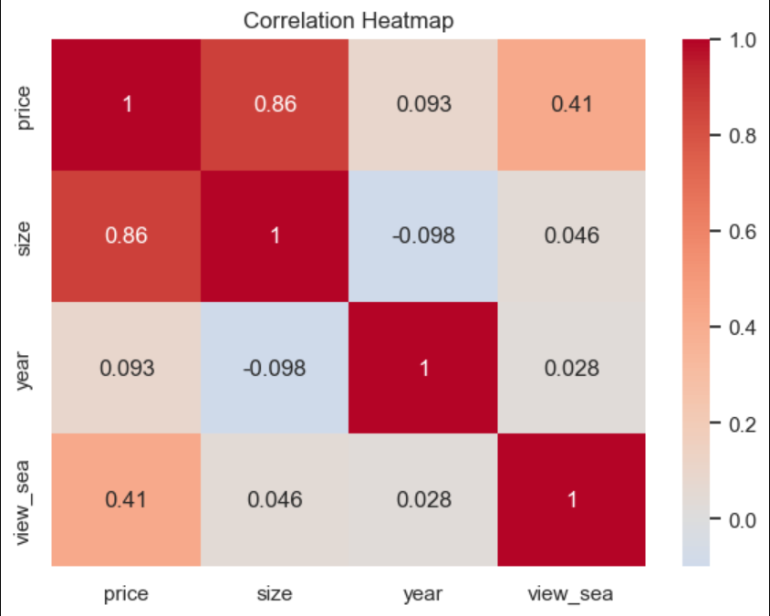
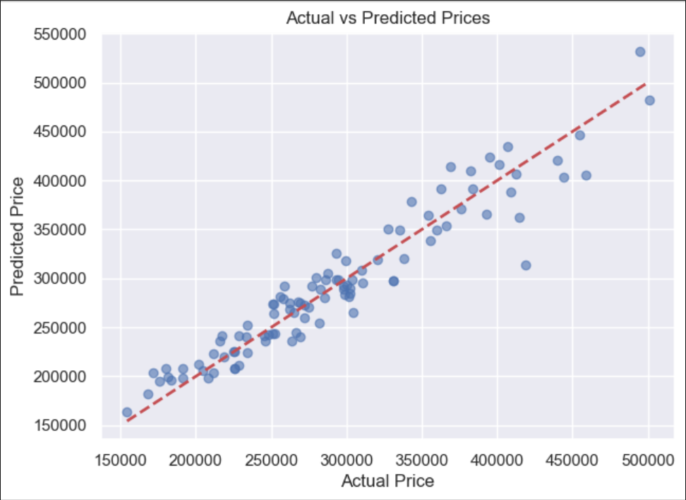
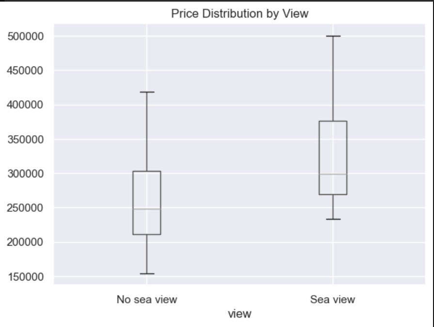

# Real Estate Price Predictor - Multiple Regression

## Overview
Predicts house prices using **three features**: size, year, and sea view.

## Results
| Feature | Impact on Price |
|---------|-----------------|
| Size | +$219 per sq ft |
| Year | +$2,719 per year |
| Sea view | +$56,726 |

**Model Performance:** R² = 0.92 (92% of price variation explained)

## Graphs Included
- Box plot: Sea view premium
- Correlation heatmap: Feature relationships
- Actual vs Predicted: Model accuracy
- Residual plot: Error analysis

## Visualizations

### Correlation Heatmap
*Shows how features relate to price*

### Actual vs Predicted Prices
*Points close to the diagonal line = accurate predictions*

### Price by View
*Sea view houses cost ~$56k more*

## Sample Prediction
- 1,500 sq ft, year 2015, with sea view → **$472,041**

## Tech Stack
- Python, Pandas, Scikit-learn
- Matplotlib, Seaborn

## Author
Abdulmalik Ridwan
